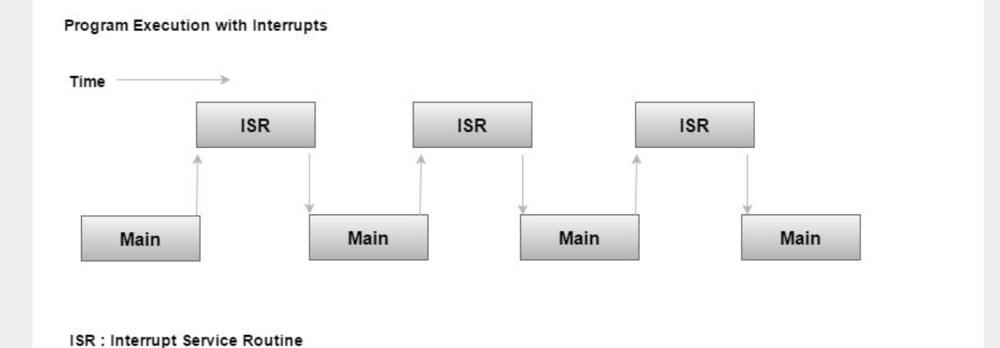

# Interrupt

An Interrupt is a signal that emitted by hardware or software indicating an event that need immediate attention.
Whenever an Interrupt occurs, the controller completes the execution of the current intruction and start the execution of an Interrupt Service Routine (ISR)

## ISR

For every Interrupt, there must be an Interrupt Service Routine. 
ISR has a fixed location in memory called the address of the ISR.
The table of the memory location that hold the addresses of ISRs is called as the Interrupt Vector Table

