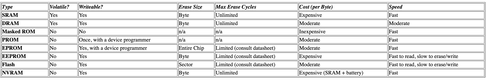

# Various types of memory

- RAM
- ROM
- Hybrid

## RAM

Volatile memory: the contents are lost when the power is shut off

### DRAM

DRAM has an extremely short data lifetime (about 4 milliseconds). 
DRAM need a hardware called DRAM controller for priodically refreshing the data stored in DRAM.

### SRAM

SRAM retains its contents as long as electrical power is appied to the chip. If power is turn off or lost temporarily, its contents lost forever.
SRAM is faster than DRAM (x4 times) but SRAM is much more expensive than DRAM.
DRAM has lower cost-per-byte.

## ROM

Non-volatile memory.

### PROM

One-time Programmable ROM.

### EPROM

Erasable & Programmable ROM. 
To erase an EPROM, expose the chip to a strong source of ultraviolet light.

## Hybrid

### EEPROM

Electrically Erasable & Programmable ROM. Any byte within an EEPROM might be erased and rewritten.
The data remains forever or until it electrically erased.
BUT: EEPROM is high cost, write cycle is significantly longer than write to RAM

### Flash

	High density, low cost, fast (to read, but not to write), electrically reprogramable.
	BUT: can only be erased one sector at a time, not byte-by-byte.
	Typical sector size is in range 256 byte to 16kB.

### NVRAM
	
	Non-Volatile RAM
	An NVRAM is just a SRAM with battery backup.
	BUT: expensive even more than SRAM, battery limit the storage to a few hundred of bytes

## Sumary

