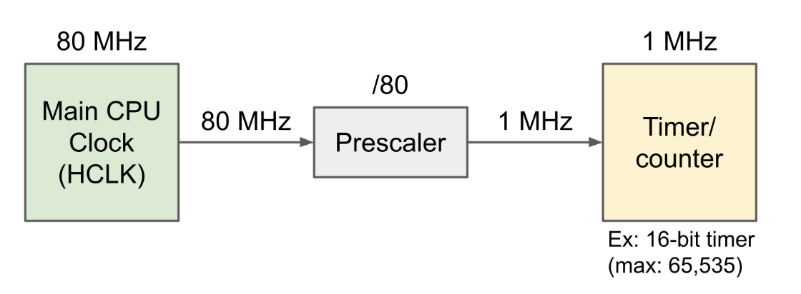

# Timer

Timer or Counter is an electronic counter capable of counting time very accurately.
Timer can count up, count down.
Timer can be 8-bit, 10-bit, 12-bit, 16-bit...
For example: 
	Timer 8-bit can be count up to maximum 255.
	When Timer counted to the maximum counter value, it fires a timer overflow event, the counter register become zero.
	If it is an one-shot timer, it stops counting.
	If it is an continuous timer, it start counting again from zero.

## Functions of Timer

- Output compare (OC): toggle a pin when a timer reaches a certain value
- Input capture (IC): mesuare the number of counts of a timer between events on a pin
- Pulse witdh modulation (PWM): toggle a pin when timer reaches a certain value and on rollover. By adjusting the duty cycle, you can effectively control the signal output.

## Prescale

Prescale is the component of the Timer that used to set-up the input clock of the Timer.

