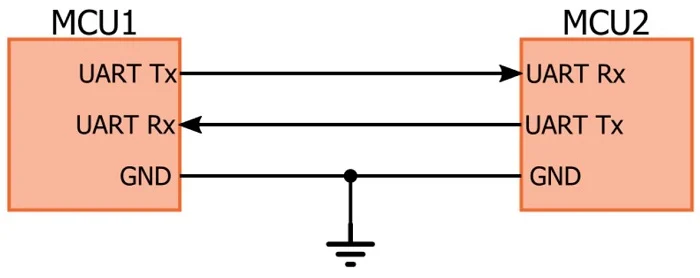
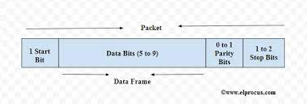

# UART

Universal Asynchronous Receiver Transmitter
Universal: Global standard
Asynchronous: There is no clock line or signal on the UART bus (line) for synchronize 
Receiver Transmitter: UART can be used for both receive and transmit

UART is a common serial communication peripheral of the micorcontroller.

## Interface

UART topology is peer to peer with two data line. Tx pin of a peer connect to Rx of the other and vice versa.

## Data transmit

Data is transmitted in byte, one by one.
Each byte transmitted flows the format of UART frame

### UART frame

#### Start bit

Usually, the transmission line is at high-voltage level in idle state. To start the transmission, the Tx send a (0) bit.

#### Data bits

5-9 bits, LSB first

#### Parity bit

Parity bit allows the Rx to check if the byte received is correct or not.
Parity could be No, Even or Odd.

#### Stop bit

1-2 bits (1)

### baudrate

Baudrate show the speed of UART. Baudrate is the maximum number of bits per second to be transmitted.
Common baudrate for UART are: 9600, 19200, 38400, 57600, 115200, 230400, 460800, 921600, 1000000, 1500000
